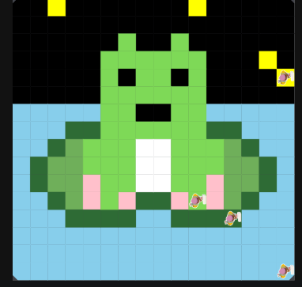

# Unit 1 - Asphalt Art

## Introduction

Cities use asphalt art to improve public safety, inspire their residents and visitors, and brighten communities. Your goal is to create asphalt art to revitalize The Neighborhood and bring the community together with the help of the Painter.

## Requirements

Use your knowledge of object-oriented programming, algorithms, the problem solving process, and decomposition strategies to create asphalt art:
- **Create a new subclass** – Create at least one new subclass of the PainterPlus class that is used for a component of the asphalt art design.
- **Plan an algorithm** – Use the problem solving process and decomposition strategies to plan an algorithm that incorporates a combination of sequencing, selection, and/or iteration.
- **Write a method** – Write at least one method in a PainterPlus subclass that contributes to a component of the asphalt art design.
- **Document your code** – Use comments to explain the purpose of the methods and code segments.

## Notes: Neighborhood & Painter Class

This project was created on Code.org's JavaLab platform using the built-in Neighborhood GUI output. To test and edit this project you must build in Code.org's JavaLab with the Neighborhood GUI enabled. For reference to the Painter class documentation, [you can read more here.](https://studio.code.org/docs/ide/javalab/classes/Painter)

## Output:

## Reflection

1. Describe your project.

My project depicts a frog sitting on a lilypad, over a blue lake. It is dark outside with fireflies flying around, projecting yellow lights. 

2. What are two things about your project that you are proud of?

I would say one thing im most proud about in regards to the picture would be the lilypad that the frog is sitting on. It took awhile to make it look somewhat accurate. And code-wise I would say codign the different paitners to do specifically the action they were required to do without going off the grid. 

3. Describe something you would improve or do differently if you had an opportunity to change something about your project.

If i could go back and do something differently, i would definently change the spacing of the fireflies, since two of them are really close together. 

4. How is this project related to STEAM (Science, Technology, Engineering, Art, and Mathematics)? Provide explicit examples from the project and details as possible. 

For Mathematics, being able to caluclate how far the painter should go before leaving the grid was challanging for me, but i eventually figured it out. I would also say coding counts for Technology and Art, since the task was to code a mural, which takes both skill in art and coding. 

5. What SLOs did you demonstrate during completing this project?

